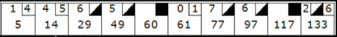
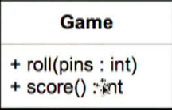
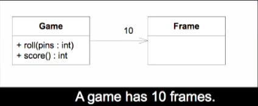
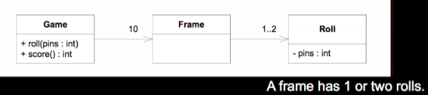
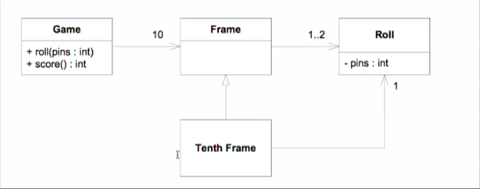
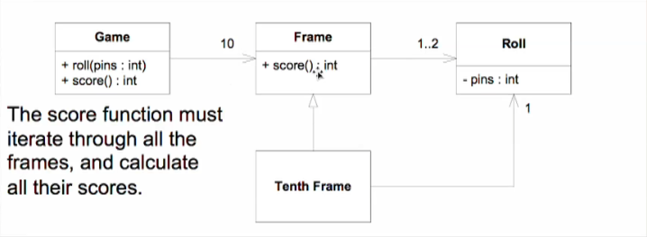
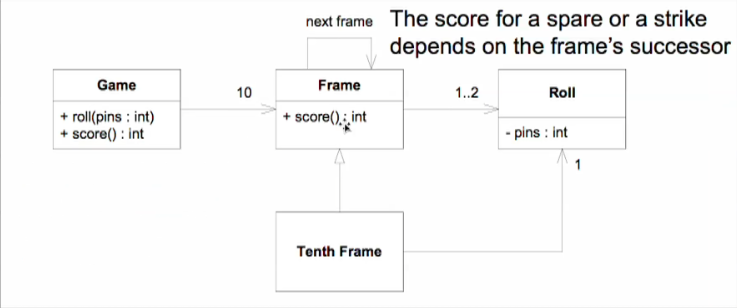

# 0. 개요

이 프로젝트에서는 밥아저씨를 비롯한 많은 사람들이 10여간 TDD를 설명하기 위한 예제로 사용한 Bowling Game을 TDD로 구현하는 것을 설명하고,
TDD에 대한 반발과 이에 대한 답변에 대해 알아본다.

## Bowling Game Demo



* 규칙
	* 볼링 게임은 10개의 프레임으로 구성된다.
	* 각 프레임은 대개 2 롤을 갖는다(10개의 핀을 쓰러 뜨리기 위해 2번의 기회를 갖는다).
	* Spare: 10 + next first roll에서 쓰러 뜨린 핀수.
	* Strike: 10 + next two rolls에서 쓰러 뜨린 핀수.
	* 10th 프레임은 특별. spare 처리하면 3번 던질 수 있음.

## 이 예제의 목적

Game이라는 클래스를 생성하는 것이 이 예제의 목적이다.



* Game 클래스는
	* roll과 score라는 2개의 메소드를 갖는다.
	* roll 메소드는 ball을 roll할 때마다 호출된다. 인자로는 쓰러뜨린 핀수를 갖는다.
	* score 메소드는 게임이 끝난 후에만 호출되어 게임의 점수를 반환한다.

## 간단한 설계 과정



* 게임은 10개의 프레임을 갖는다.
	* Game은 roll, score 함수를 갖는다.
	* Game은 10개의 Frame을 갖는다.



* Frame은 1..2개의 Roll을 갖는다.
	* 10번 프레임은 예외를 갖는다(1..2 roll을 갖는 것이 아니라 2..3 roll을 갖는다).
	* 객체지향에서 이런 예외를 어떻게 표현하나 ???



** score 함수의 알고리즘

frame수만큼 loop를 돌면서 각 frame의 점수를 합산할 것이다.



frame은 roll수 만큼 loop를 돌면서 점수를 계산할 것이다. strike, spare를 위해서 look ahead roll을 해야 한다.



## 자 이제 설계가 있다. 이제 TDD를 할 차례

TDD에서 이상한 일을 한다. 설계를 무시하는 것이다. 완전히 무시하는 것은 아니고 따르지 않는 것이다. 단지 가이드 라인의 일정으로 사용한다.

```
public class BowlingTest {
  @Test
  public void nothing() {
  }
}
```

* **아무것도 없는 nothing이라는 테스트로 시작**. 이것도 실행해 본다. 밥 아저씨는 **항상 뭔가 실행되는 것으로 시작**한다고 한다. 그래서 **심지어 의미 있는 코드가 하나도 없더라도 실행되는 뭔가를 가지고 있다**.
* 그리곤 지운다. 아마 테스트 작성을 위한 설정이 제대로 되었는지 확인하는가보다. 나중에 알았지만 항상 동작하는 코드로 작업하기 위해서이다. 이게 **개발자들에게는 편안함을 준다**.
* 무슨 테스트를 작성해야 하나 ?
	* failing unit test가 있기 전에는 production code를 작성하면 안된다.
	* 하지만 이미 개발자는 어떤 production code를 작성해야 하는지 안다. public class Game을 작성해야 한다는 것을 ...
	* 그러나 우리는 public class Game을 작성하도록 허가 받지 않았다. 우리는 유닛 테스트를 먼저 작성해야 한다.
* **어떤 테스트를 작성해야 내가 원하는 코드를 작성하게 될까 ?**
	* 어떤 failing test를 작성해야 Game.java에 public class Game을 선언하게 될까 ?
* 이제부터 red-green-refactor cycle로 들어가자.
	* red phase: next most interesting case but still really simple
	* green phase: make it pass
	* blue phase: refactor
* 가장 쉽고(간단하고) 흥미로운(easy/simple and interesting) 테스트부터 작성

# 1. canCreateGame

## 1.1 add failing test
```
@Test
public void canCreateGame() {
  Game g = new Game();
}
```
## 1.2 make it pass
  - IDE의 hot fix를 이용(F2: next error, opt+enter: hot fix)

# 2. canRoll

## 2.1 add failing test
  - 스코어를 바로 계산하기 보다는 이를 위한 과정으로 canRoll을 먼저 추가
  - 넘어진 pin수가 0인 것에 대한 failing test를 먼저 추가

```
@Test
public void canRoll() {
    Game g = new Game();
    g.roll(0);
}
```
## 2.2 make it pass
  - make it pass by using hot fix

## 2.3 refactor
  - 테스트에 있는 중복(`Game game = new Game();`) 제거
  - 해당 코드를 extract field(initialize는 setUp을 선택)

### 2.3.1 canRoll
  - 불필요한 코드 제거(`@Test public void canCreate()` 메소드는 불필요)

# 3. gutterGame

## 3.1 add failing test
  - score를 바로 호출하고 싶지만, 게임이 끝나야만 score함수를 호출할 수 있다.
  - 게임을 끝내는 가장 간단한 방법은 gutter game이다.

```
@Test
public void gutterGame() {
    for(int i = 0; i < 20; i++)
        game.roll(0);
    assertThat(game.score(), is(0));
}
```
## 3.2 make it pass

# 4. allOnes

## 4.1 add failing test
  - next most simple and interesting test case

```
@Test
public void allOnes() {
    for(int i = 0; i < 20; i++)
        game.roll(1);
    assertThat(game.score(), is(20));
}
```

## 4.2 make it pass
```
private Integer score = 0;

public void roll(int pins) {
    score += pins;
}

public Integer score() {
    return score;
}
```

## 4.3 refactor
  - extract variable
    - gutterGame()에서 rolls, pins를 추출

```
@Test
public void gutterGame() {
    int rolls = 20;
    int pins = 0;
    for(int i = 0; i < rolls; i++) {
        game.roll(pins);
    }
    assertThat(game.score(), is(0));
}
```
  - extract method - rollMany()

```
@Test
public void gutterGame() {
    int rolls = 20;
    int pins = 0;
    rollMany(rolls, pins);
    assertThat(game.score(), is(0));
}

private void rollMany(int rolls, int pins) {
    for(int i = 0; i < rolls; i++)
        game.roll(pins);
}
```
  - inline variables

```
@Test
public void gutterGame() {
    rollMany(20, 0);
    assertThat(game.score(), is(0));
}
```

# 5. oneSpare

## 5.1 add failing test
  - gutter, allOne이 있으니 allTwo를 생각해 볼 수 있으나 이건 잘 동작할 것이다.
  - 뻔히 동작할 것을 알 수 있는 테스트는 작성할 필요가 없다.
  - allThree, allFour도 잘 동작할 것이다. 그런데 allFive는 그렇지 않다. spare가 있기 때문에.
  - spare에 대한 테스트를 작성할 차례이다. 가장 간단한 spare는 어떤 경우가 있을까 ? one spare + gutter.

```
@Test
public void oneSpare() {
    game.roll(5);
    game.roll(5); // spare
    game.roll(3);
    rollMany(17, 0);
    assertThat(game.score(), is(16));
}
```

## 5.2 make it pass
  - 근데 어떻게 해야 할지 모르겠다.
  
```
public void roll(int pins) {
    if(pins + lastPins == 10)
    ...
}
```

  - 위와 같이 하려다 보니 이상하다. 플래그 변수, 정적 변수를 사용해야 하고…
  - 이처럼 끔찍한 일을 해야 하는 경우가 생길때마 잠시 물러나야 한다.
  - 뭔가 디자인이 잘 못된 것이다.
  - **디자인 원칙이 위배**된 것이 있다.
  - **첫번째 원칙: 스코어를 계산하는 것을 의미하는 이름을 갖는 함수가 무엇인가 ?**
  - score 함수이다. 근데 실제로 score를 계산하는 함수는 roll 함수이다.
  - **잘못된 책임 할당**(misplaced responsibility)이 디자인 원칙, 잘못된 디자인 냄새이다.
  - roll에선 각 roll을 저장하고, score에서 계산을 해야 한다.
  - 어쩌지. refactoring. 근데 failing test가 있다. **@Ignore 처리…**

## 5.3 refactoring
  - 이제 테스트가 수행되니 리팩토링하자.
  - Roll을 배열에 저장하자.
  - 이에 잘못된 책임 할당이 해소되었다.

```
public class Game {
    private int[] rolls = new int[21];
    private int currentRoll = 0;

    public void roll(int pins) {
        rolls[currentRoll++] = pins;
    }

    public Integer score() {
        int score = 0;
        for(int i = 0; i < rolls.length; i++)
            score += rolls[i];
        return score;
    }
}
```
  - frame을 도입하여 읽기 쉽게한다.

```
public Integer score() {
    int score = 0;
    int i = 0;
    for(int frame = 0; frame < 10; frame++) {
        score += rolls[i] + rolls[i + 1];
        i += 2;
    }
    return score;
}
```

# 7. oneSpare

## 7.1 add failing test
  - @Ignore 제거

## 7.2 make it pass

```
if(rolls[i] + rolls[i + 1] == 10) { // spare
    score += 10 + rolls[i + 2];
    i += 2;
}
else {
    score += rolls[i] + rolls[i + 1];
    i += 2;
}
```

## 7.3 refactoring
  - rename i to firstFrame
  - **처음부터 firstFrame이라는 변수명을 찾은 것이 아니라 여러차례의 시도로 찾음**

### 7.3.1 refactoring
  - extract method **isSpare**

### 7.3.1 oneSpare - refactoring
  - remove duplication - **comment // spare**

### 7.3.1 oneSpare - refactoring
  - extract method for readability(rollSpare)

```
@Test
public void oneSpare() {
    rollSpare();
    game.roll(3);
    rollMany(17, 0);
    assertThat(game.score(), is(16));
}

private void rollSpare() {
    game.roll(5);
    game.roll(5);
}
```

# 8. oneStrike

## 8.1 add failing test

```
@Test
public void oneStrike() {
    game.roll(10);
    game.roll(5);
    game.roll(3);
    rollMany(16, 0);
    assertThat(game.score(), is(26));
}
```

## 8.1 make it pass

```
if(rolls[firstFrame] == 10) { // strike
    score += 10 + rolls[firstFrame + 1] + rolls[firstFrame + 2];
    firstFrame += 1;
}
else if(isSpare(firstFrame)) {
...
```

## 8.3 refactoring
  - extract method **isStrike**

### 8.3.1 refactoring
  - extract method for readabiliy(nextTwoBallsForStrike, nextBallForSpare, nextBallsInFrame)
  
```
if(isStrike(firstFrame)) {
    score += 10 + nextTwoBallsForStrike(firstFrame);
    firstFrame += 1;
}
else if(isSpare(firstFrame)) {
    score += 10 + nextBallForSpare(firstFrame);
    firstFrame += 2;
}
else {
    score += nextBallsInFrame(firstFrame);
    firstFrame += 2;
}
```

### 8.3.2 refactoring
  - extract method for readabiliy(rollStrike)
  
```
@Test
public void oneStrike() {
    rollStrike();
    game.roll(5);
    game.roll(3);
    rollMany(16, 0);
    assertThat(game.score(), is(26));
}

private void rollStrike() {
    game.roll(10);
}
```

# 9. perfectGame

## 9.1 perfectGame

```
@Test
public void perfectGame() {
    rollMany(12, 10);
    assertThat(game.score(), is(300));
}
```

  - red phase인데 테스트가 성공한다. 왜 그럴까 ?
  - production code를 살펴보니 3개의 경우 수가 있는데, 실제 볼링 게임에도 그 3가지 경우 수만 존재한다.